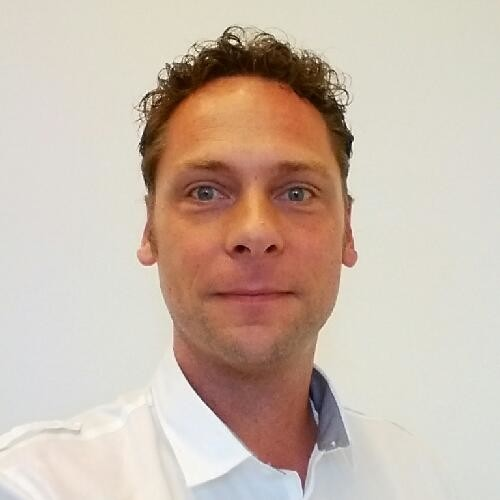

  <h1>Marco Pas</h1>
  

    <i class="fa-solid fa-envelope"></i> [marco.pasopas@gmail.com](mailto:marco.pasopas@gmail.com) |
    <i class="fa-brands fa-github"></i> [GitHub](https://github.com/mpas) |
    <i class="fa-brands fa-linkedin"></i> [LinkedIn](https://www.linkedin.com/in/marcopas)  
    <i class="fa-solid fa-phone"></i> (+31) 6 18808 51
  

# Summary

  
  
Experienced Software, Cloud & DevOps Engineer/Architect with hands-on expertise in application development, cloud infrastructure, and automation. Skilled at simplifying complex systems to deliver scalable, practical solutions. Proven leader with experience managing and mentoring engineering teams, fostering high-trust environments and professional growth. An effective communicator thriving in multicultural teams, bridging technical concepts with business impact. Active open-source contributor and international tech speaker.
  

# Employment

## Philips – Eindhoven (10/2017 – Present)

### Developer Experience Engineer / Engineering Coach (05/2024 – Present)

- Member of the Software Center of Excellence, supporting teams across the organization in adopting modern engineering practices.
- Driving improvements in developer experience by introducing standards, templates, and tooling around CI/CD, quality, and observability.
- Leading the implementation of an internal developer portal using Backstage, integrating software catalogs, documentation, and self-service capabilities to streamline development workflows.
- Advocating for scalable, secure, and high-quality engineering approaches aligned with industry best practices.

### Software Engineer / Architect – Cloud & Platforms (10/2017 – 05/2024)

- Defined and implemented cloud-native architectures for global research and product groups, ensuring high quality and security compliance.
- Developed a data ingestion and analysis product for ICU monitoring using AWS serverless technologies, focusing on autoscaling, availability, and performance.
- Collaborated with internal incubators to prioritize features and deliver cloud-native solutions.
- Championed software quality and security best practices, including CI-based code and container security scanning.
- Established organization-wide Software Project XRays to drive continuous improvement and adherence to corporate quality standards.
- Delivered platform capabilities such as secure device registration, microservice discovery, centralized identity management, unified logging, and infrastructure monitoring.

### Software Engineering Manager (08/2020 – 09/2022)

- Supported and led a team of 25 engineers, focusing on coaching, mentoring, and professional development.
- Set team goals aligned with strategic priorities and facilitated daily operations.
- Cultivated a high-trust culture that embraced creativity, learning, and safe experimentation.
- Identified training needs, promoted innovation, and fostered collaboration and accountability.

## Software Engineer/Architect Cloud & Platforms, Signify - Eindhoven (10/2013 - 10/2017)

- Designed and implemented a global cloud-based product platform with polyglot microservices supporting multiple product lines.
- Built CI/CD pipelines using Jenkins, Docker, AWS ECS/ECR, and Terraform to enable infrastructure as code and continuous deployment.
- Developed a message-driven microservice architecture with service discovery (Consul), unified logging (Fluentd), and monitoring (CloudWatch, Prometheus).
- Led IoT platform development using MQTT protocol, integrating secure device management and scalable cloud infrastructure.

## Software Engineer/Architect EV Solutions, IHomer - Etten-Leur (12/2008 - 10/2013)

- Led the design and implementation of a web-based EV charging platform for clients including Open Charge Alliance, E-Laad, and Alfen, based on REST/AMQP architecture.
- Served as technical lead and OCPP steering committee member, shaping protocol evolution and delivering public presentations across Europe.
- Delivered key platform features such as hardware monitoring, firmware updates, self-service tools, session tracking, and third-party integrations via RESTful APIs and OCPP.
- Built proof-of-concept integrations and guided a development team using technologies like Java, Groovy, Grails, Spring, RabbitMQ, and MySQL in an Agile environment.

## Software Engineer/Competence Lead, CGI - Rotterdam (09/1997 - 12/2008)

- Delivered mobile, web, and intranet solutions for major clients including Shell, KLM, NS, and Unilever, using Java, .NET, and open-source technologies.
- Led the design and implementation of innovative platforms such as mobile ticketing (ICT Award winner) and Kennisnet’s e-learning system.
- Served as Competence Lead and Innovation Architect in the "Working Tomorrow" incubator, driving emerging tech initiatives.
- Acted as a technical trainer and advisor, introducing J2EE concepts and architectural standards across teams and clients.

## Internal IT Support, Jan de Rijk Logistics - Roosendaal (10/1995 - 09/1997)

- Led implementation of internal logistics projects, including transport planning, vehicle tracking (track and trace), robotic warehousing, and route registration systems.

# Technical Skills

## Techniques

- **DevOps / ChatOps**
  - Immutable Builds, Builds as Code
  - CI/CD Pipelines (GitHub Actions, Jenkins, GitLab CI)
  - Container Registries (Docker Hub, Amazon ECR, GitHub Container Registry)
- **Developer Experience (DX)**
  - Internal Developer Portals (Backstage)
  - Developer Onboarding & Documentation
  - Metrics & Insights into Developer Productivity (DORA metrics)
- **GitOps**
  - ArgoCD
- **Immutable Operating Systems**
  - Suse Linux Micro, Elemental
- **Infrastructure and Container Compliance**
  - InSpec, Goss, Trivy, Clair
- **Infrastructure as Code & Automation**
  - Terraform, Helm, Packer, Ansible
- **Internet of Things**
  - MQTT, HiveMQ
- **Message Driven Architectures**
  - AMQP, JMS, RabbitMQ, AWS SQS
- **Methodologies**
  - TDD, Agile/Scrum, SAFe (Scaled Agile Framework), Kanban
- **Microservices**
  - Service Discovery (Consul, Eureka, AWS Route53)
  - Monitoring & Observability (Prometheus, Grafana, InfluxDB, AWS CloudWatch, Fluentd, Elasticsearch, Kibana)
  - Logging (Fluentd, AWS CloudWatch/Kibana)
  - Container Orchestration (Kubernetes, Docker, AWS ECS)

- **Serverless**
  - AWS Lambda
- **Software Engineering Practices**
  - Continuous Integration, Continuous Delivery (including GitHub Actions, Jenkins, GitLab CI)
  - Unit Testing, Integration Testing, Test Automation Frameworks
  - Software Quality (Assessments, SonarQube, CodeScene, Tics)
  - Secure Software Supply Chain (SonarQube, InSpec, Goss, Clair, Trivy)
- **Time Series Databases**
  - Prometheus, InfluxDB
- **Web Services**
  - SOAP, REST, gRPC

## Tools

- **Build Tools:** Ant, Gradle, Maven, Poetry
- **Container Registries:** Amazon ECR, Docker Hub, GitHub Container Registry
- **Continuous Integration Systems:** GitHub, GitLab, Jenkins
- **Databases:** AWS RDS, MySQL, Neo4J, PostgreSQL
- **Decentralized Storage & Web3:** IPFS, libp2p, content addressing, distributed hash tables
- **Infrastructure Automation:** Ansible, Elemental, Helm, Packer, Rancher
- **Version Control Systems:** Git, Subversion

## Platforms

- **AWS Cloud Platform:** EC2, ECS, ELB/ALB, VPC, IAM, Cognito, ElasticSearch, API Gateway, Lambda, Kibana, RDS, CloudWatch, SQS, CloudFormation
- **Kubernetes:** K8S/K3s, Helm, Rancher

## Languages & Frameworks

- Java, Python, Groovy, Go, Ruby, Elixir, JavaScript, TypeScript, Lua, Shell/Bash, HTML5, XML, CSS
- Spring (Boot, Cloud, NetFlix Eureka/Hystrix)
- Grails, Micronaut
- React

# Language Skills

- Dutch: Native language
- English: Fluent (reading, speaking, writing)
- German: Elementary (reading, speaking)

# Education

- Various programming and platform courses (2014 – Present)
- Certified Scrum Master (2014)
- Dutch National ICT Award (2004)
- Certified Java Developer (2001)
- Bachelor's Degree in Laboratory Information & Automation (1997)

# Conferences & Presentations

Delivered 10+ talks at international conferences such as Gr8Conf (Copenhagen), Devoxx UK (London), and Philips Software Conference (India). Topics included software compliance, observability, container orchestration, IoT, and developer tooling.

# Side Projects

- **05/2015 – 12/2019** — _NextBuild Conference_, Philips Research — Eindhoven  
   Initiator and organizer of the free NextBuild Software Conference. The conference is intended for developers and architects passionate about software development who want to learn, meet, and share. It ran annually with ~25+ speakers, 300+ attendees, and 4 parallel tracks.
